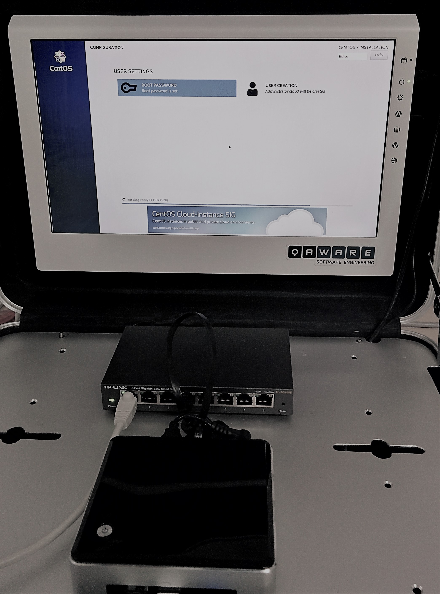

# Cloudcase running K8s
Setup instructions and tools for a Bare Metal Nuc Mini PC Cluster running Kubernets.

## CentOS 7 Installation
For this case we used a normal CentOS7 unautomated installation. 

OS Installation (CentOS 7 Full Software with UI ==> Workstation)

| Setting       | Value                            | 
| ------------- | ---------------------------------|  
| Hostname      |  node0 - node4                   |
| Domain        |                                  |
| IP-Addressen  | 192.168.1.100 - 192.168.1.104    |
| Subnetz       | 255.255.255.0                    |
| Gateway       | 192.168.1.1                      |
| DNS           | 192.168.1.1 (DNS Forward Router) |
| ---                                              |
| User          | cloud                            |
| Group         | wheel                            |
| Password      | xxxxx                            |
| ---                                              |
| User          | root                             |
| Password      | xxxxx                            |

It is important that DNS is fully functional.

